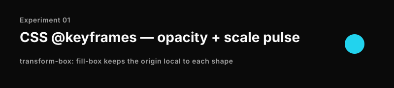
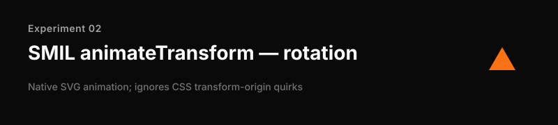
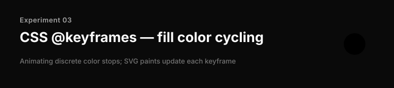
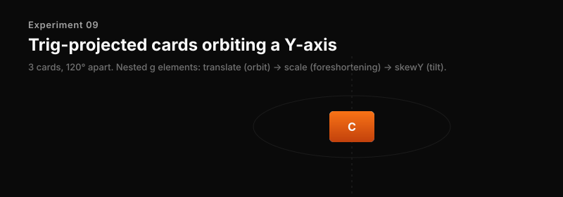

# Banner experiments

Animated-SVG-on-README capability tests. Each section embeds a single SVG to probe one specific feature. Open this file on GitHub (rendered view) to see what actually animates through camo.

If you're reading this on github.com and the SVGs look static, animations are being suppressed at your end (browser, OS reduce-motion, or camo cache miss). Hard-refresh first.

---

## 01 — CSS `@keyframes` (opacity + scale pulse)

The simplest case: a circle that pulses via `@keyframes` defined in `<style>`. `transform-box: fill-box` keeps the origin local to the shape — without it, CSS transform-origin in SVG is finicky.

---

## 02 — SMIL `<animateTransform>` (rotation)

Native SVG animation, predates CSS animations. More predictable than CSS for transforms in SVG because origin/coordinate handling is unambiguous.

---

## 03 — CSS `@keyframes` (fill color cycling)

Animating `fill` through a sequence of stop colors. Works the same way `background-color` does in CSS.

---

## 04 — SMIL counter (`<animate attributeName="textContent">`)

The dynimage commits-card trick: animate a text element's contents through discrete values, freeze on the final one. Use `calcMode="discrete"` so each value snaps rather than interpolating mid-render.

---

## 05 — Sheen sweep (gradient + translate)

A linear gradient with mid-stop alpha, translated continuously across the canvas. Same primitive dynimage uses for the commits-card backdrop sheen.

---

## 06 — Fake-3D globe

The actual museum-header experiment. Pure SVG composition:

- Radial gradient circle → sphere appearance
- Continents in a `<g>` that rotates inside a `clipPath` (so they slide off the edges convincingly)
- Second non-rotating gloss highlight overlay → fixed-light illusion
- Inner rim shadow for depth
- Project marker with a dual-ring pulse via SMIL `<animate>` on `r` and `opacity`
- Static starfield around

No actual 3D transforms — the spherical look is entirely 2D primitives composed cleverly.

---

## 07 — Theme-responsive (`prefers-color-scheme`)

Same trick dynimage uses in `responsiveThemeStyle`: declare both color sets via CSS custom properties, switch via `@media (prefers-color-scheme: dark)`. One URL, both themes — the viewer's browser resolves at render time. Switch your GitHub theme (Settings → Appearance) and refresh to compare.

---

## 08 — Compound mockup (production aspect)

What an actual museum-header banner could look like, combining: sheen sweep + globe + pulse + counter + tier dots + theme-aware text + subtle CTA pulse. Sized 1280×320 to match the production aspect.

---

## 09 — Trig-projected cards orbiting a Y-axis

Three cards 120° apart, orbiting on an ellipse. **Three separate `<animateTransform>` per card, one per SMIL transform type** (translate, scale, skewY) on nested `<g>` elements — `type="matrix"` is not a valid SMIL transform type, only the five primitives are.

Math: at each keyframe at orbit angle θ:

- `translate(R·sin(θ), 0)` — orbit position
- `scale(cos(θ), 1)` — foreshortening (compressed to ~0 at the sides)
- `skewY(K·sin(θ))` with K ≈ 23° — leans into perspective as the card swings around
- `opacity = max(0, cos(θ))` — fades out around the back of the sphere

Same animation block per card, phase-shifted via negative `begin` (`0s`, `-3s`, `-6s` on a 9s loop). Proof-of-concept for the "invisible sphere with project cards" visual.

---

## What to look for

| Works                                                       | Doesn't work                           |
| ----------------------------------------------------------- | -------------------------------------- |
| CSS `@keyframes` (transform, opacity, fill, etc.)           | JavaScript — camo strips it            |
| SMIL `<animate>` / `<animateTransform>` / `<animateMotion>` | External fonts (must inline as base64) |
| `@media (prefers-color-scheme: dark)`                       | External images (must inline)          |
| Gradients, filters, masks, clipPath                         | `:hover` and pointer events            |
| Multi-layer composition for fake-3D                         | True 3D transforms (SVG 1.1 has none)  |

If you see anything frozen, that's the limit and we should know about it before building the production renderer.
